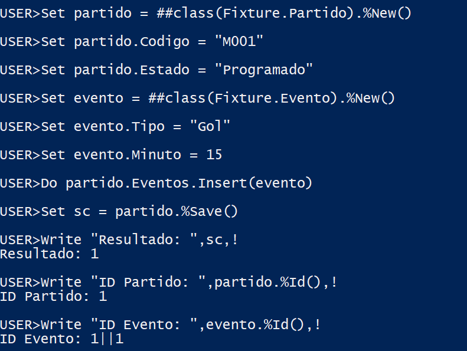
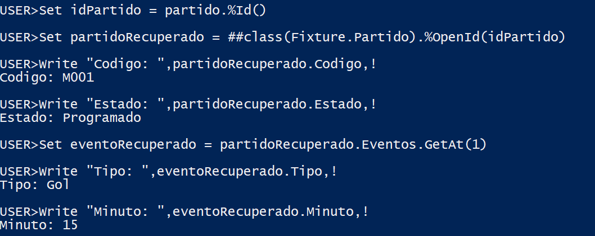
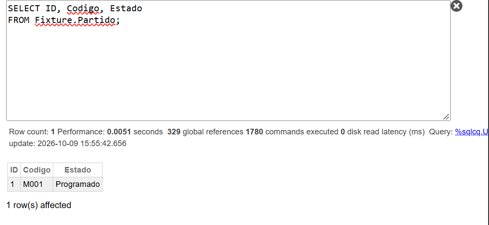
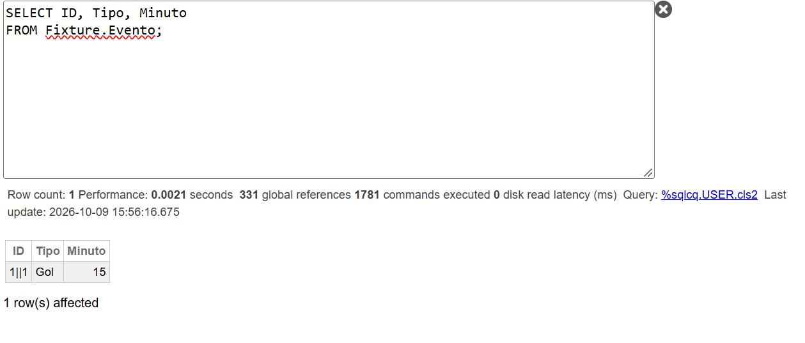
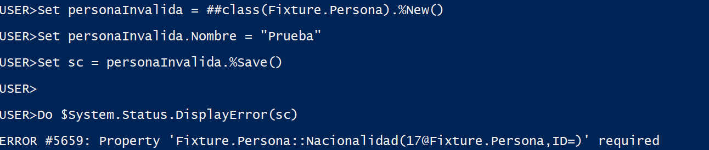
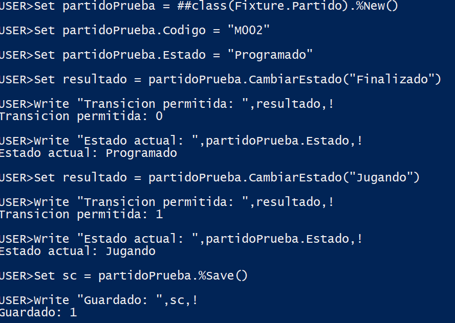
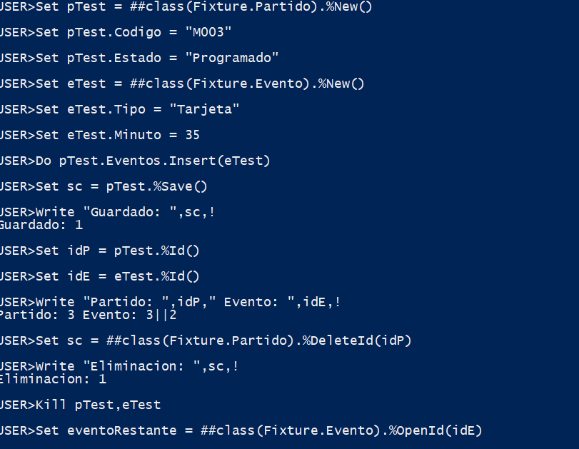
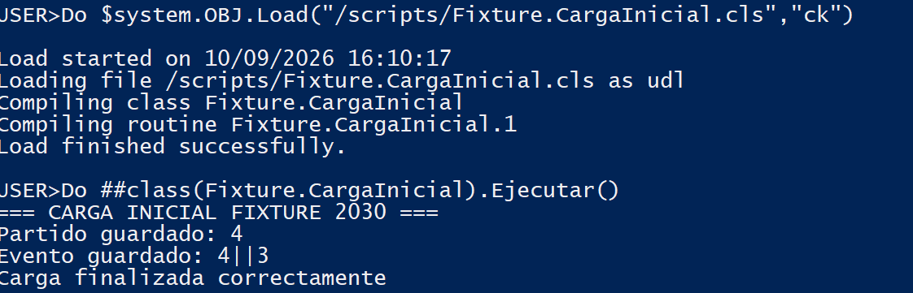

# Hito 9 — Entidades Complejas del Fixture 2030

## 1. Descripción general

Este módulo implementa una base de datos orientada a objetos utilizando InterSystems IRIS Community Edition.

El objetivo es representar entidades complejas del Fixture Mundial 2030 mediante clases persistentes, herencia, relaciones bidireccionales y métodos de validación.

La implementación utiliza ObjectScript y permite almacenar, recuperar y consultar objetos sin depender de un ORM externo.

También demuestra las capacidades multimodelo de IRIS, que permiten consultar mediante SQL los datos almacenados como objetos.

## 2. Tecnologías utilizadas

- InterSystems IRIS Community Edition.
- ObjectScript.
- Docker y Docker Compose.
- SQL.
- Git y GitHub.

El desarrollo se realizó en Windows, utilizando Docker Desktop con backend WSL2 (Ubuntu).

## 3. Estructura del proyecto

```text
IRIS/
├── docker-compose.yml
├── README.md
├── Diagrama_UML.jpg
├── scripts/
│   ├── Fixture.Persona.cls
│   ├── Fixture.Jugador.cls
│   ├── Fixture.Arbitro.cls
│   ├── Fixture.Partido.cls
│   ├── Fixture.Evento.cls
│   ├── Fixture.CargaInicial.cls
│   └── pruebas_hito9.mac
└── evidencias/
    ├── 01_persistencia.png
    ├── 02_navegacion.png
    ├── 03_consultas_partidos.png
    ├── 04_consultas_eventos.png
    ├── 05_validacion_required.png
    ├── 06_validacion_estado.png
    ├── 07_integridad.png
    ├── 07.2_integridad.png
    ├── 08_carga_inicial.png
    └── 09_pruebas_hito9.txt
```

Los archivos `.cls` contienen las definiciones de clases persistentes y el procedimiento de carga inicial.

`pruebas_hito9.mac` reúne la demostración completa como bloques de comandos del Terminal (ver sección 14).

La carpeta `evidencias/` contiene capturas de las pruebas realizadas y la salida completa del script de pruebas.

El `.gitignore` se encuentra en la raíz del repositorio.

## 4. Modelo de dominio

Se implementaron cinco clases principales:

| Clase | Descripción | Persistencia |
|---|---|---|
| Persona | Contiene los atributos comunes de las personas. | %Persistent |
| Jugador | Representa a un jugador de fútbol. | Hereda de Persona |
| Arbitro | Representa a un árbitro. | Hereda de Persona |
| Partido | Representa un partido y sus estados. | %Persistent |
| Evento | Representa un acontecimiento de un partido. | %Persistent |

Además, se implementó `Fixture.CargaInicial`, una clase auxiliar que ejecuta la carga de datos.

### 4.1. Diagrama de clases UML


El diagrama representa la herencia y la relación padre-hijo implementadas.

## 5. Herencia

Se implementó la clase base `Fixture.Persona`, que contiene propiedades compartidas por las personas del dominio.

Las clases `Fixture.Jugador` y `Fixture.Arbitro` heredan de Persona.

Jugador agrega:

- Numero.
- Posicion.

Arbitro agrega:

- Rol.
- LicenciaFIFA.

La herencia permite reutilizar propiedades y evitar duplicación de código.

Se utiliza para representar especializaciones estables del dominio, no estados temporales.

## 6. Relaciones e integridad referencial

Se implementó una relación padre-hijo entre Partido y Evento.

Un Partido puede contener múltiples Eventos.

Cada Evento pertenece a un Partido.

La relación utiliza:

- `Cardinality = children` en Partido.
- `Cardinality = parent` en Evento.
- `Inverse` para establecer la relación bidireccional.

Esto permite navegar desde un Partido hacia sus Eventos y mantener la integridad referencial.

### 6.1. Matriz de integridad

| Regla | Implementación | Comportamiento esperado |
|---|---|---|
| Un Partido debe tener código. | Property Codigo [Required] | Rechaza el guardado si falta. |
| Un Partido debe tener estado. | Property Estado [Required] | Rechaza el guardado si falta. |
| El código del Partido debe ser único. | Index idxCodigo [Unique] | Rechaza códigos duplicados. |
| Un Evento depende de su Partido. | Relationship parent/children | Mantiene la dependencia entre objetos. |
| Si se elimina el Partido, se eliminan sus Eventos. | Relación padre-hijo | Eliminación en cascada. |
| Una Persona debe tener nombre y nacionalidad. | Propiedades [Required] | Rechaza datos incompletos. |
| Un Partido no debe pasar directamente de Programado a Finalizado. | Método CambiarEstado() | Rechaza la transición mediante el método. |

La validación de estado se encuentra encapsulada en el método `CambiarEstado()`.

La implementación actual no impide modificar directamente la propiedad Estado desde otro código. Por lo tanto, las transiciones deben realizarse mediante el método para respetar esa regla.

## 7. Índices

Se implementaron dos índices:

### idxCodigo

Definido sobre `Partido.Codigo`.

Garantiza que no existan partidos con el mismo código.

### idxPartido

Definido sobre la relación `Evento.Partido`.

Permite localizar los Eventos asociados a un Partido de manera eficiente.

Este índice evita depender de recorridos completos sobre los Eventos cuando se necesita recuperar una colección de hijos.

La decisión sigue las buenas prácticas de indexación del lado hijo vistas en la Clase 10.

## 8. Configuración de Docker

Se utilizó la imagen oficial:

`intersystems/iris-community:latest-cd`

El servicio se configuró mediante Docker Compose.

### Puertos

| Puerto de Windows | Puerto interno | Función |
|---|---|---|
| 1972 | 1972 | Conexión al motor IRIS |
| 52873 | 52773 | Management Portal |

Se modificó el puerto externo del Management Portal porque Windows tenía reservado el puerto 52773.

El puerto interno de IRIS permanece sin modificaciones.

### Persistencia

El directorio durable de IRIS (`ISC_DATA_DIRECTORY=/durable`) se monta en la ruta exigida por la materia:

`${HOME}/docker/data/iris` → `/durable`

Allí IRIS guarda su configuración (Durable %SYS) y las bases de datos, por lo que los objetos sobreviven a `docker compose down` y a la recreación del contenedor.

#### Por qué debe ejecutarse desde WSL2 (Linux)

Al arrancar, IRIS ejecuta `chown irisowner:irisowner /durable`. Esto genera dos problemas posibles:

1. **Carpeta de Windows (NTFS).** Si `~` es `C:\Users\<usuario>` (PowerShell o CMD), el bind mount no admite cambiar el dueño a un usuario Linux. IRIS no arranca:
   `ERROR #5001: Error executing chown irisowner:irisowner /durable/`
2. **Carpeta Linux con otro dueño.** IRIS corre como `irisowner` (UID 51773), no como root, y solo root puede cambiar el dueño de un archivo. Si la carpeta pertenece al usuario de WSL, el `chown` falla aunque tenga permisos `777`.

Por eso el entorno se levanta desde una distribución WSL2 (Ubuntu), con la carpeta creada previamente y asignada al UID de `irisowner`.

No deben versionarse los datos persistentes del motor: viven fuera del repositorio.

## 9. Instalación y ejecución

Requisitos: Docker Desktop con backend WSL2 y una distribución Ubuntu con la integración activada (*Settings → Resources → WSL integration*).

Todos los comandos se ejecutan **desde la terminal de Ubuntu (WSL)**, no desde PowerShell. El repositorio puede quedar en el disco de Windows y accederse por `/mnt/c/...`.

### 9.1. Preparar el directorio durable (una sola vez)

```bash
mkdir -p ~/docker/data/iris
sudo chown -R 51773:51773 ~/docker/data/iris   # 51773 = UID/GID de irisowner en la imagen
```

Si no se dispone de `sudo`, el mismo cambio puede hacerse con un contenedor efímero que corre como root:

```bash
docker run --rm -u 0 --entrypoint chown -v "$HOME/docker/data/iris:/d" \
  intersystems/iris-community:latest-cd -R 51773:51773 /d
```

No borrar los datos existentes para resolver un error de permisos: alcanza con repetir el `chown` y recrear el contenedor.

### 9.2. Iniciar Docker

```bash
cd IRIS
docker compose up -d
```

### 9.3. Verificar el contenedor

```bash
docker compose ps        # debe figurar (healthy)
docker compose logs iris | grep -i durable
```

### 9.4. Ingresar al Terminal de IRIS

```bash
docker exec -it fixture2030-iris iris session IRIS
```

El Management Portal queda disponible en `http://localhost:52873/csp/sys/UtilHome.csp`.

## 10. Carga y compilación de clases

Desde el Terminal de IRIS, en el namespace USER, ejecutar:

```objectscript
Do $system.OBJ.LoadDir("/scripts","ck",.err)
Write "Errores de compilacion: ",+$Get(err),!
```

`LoadDir` carga todos los `.cls` de la carpeta y los compila como un único lote. Esto resuelve la dependencia mutua entre Partido y Evento (cada una referencia a la otra en su `Relationship`) sin necesidad de cargarlas y compilarlas por separado.

Las seis clases compilan con 0 errores (ver `evidencias/09_pruebas_hito9.txt`).

## 11. Carga inicial de objetos

Se implementó la clase `Fixture.CargaInicial`, que contiene el método `Ejecutar()`.

La carga crea:

- Un Partido identificado como M004.
- Un Evento de tipo Gol.
- Una relación padre-hijo entre ambos.

Para ejecutar la carga:

```objectscript
Do ##class(Fixture.CargaInicial).Ejecutar()
```

El procedimiento utiliza `%New()` para instanciar objetos.

La relación se establece mediante:

```objectscript
Do partido.Eventos.Insert(evento)
```

Finalmente, ambos objetos se almacenan mediante una sola llamada:

```objectscript
Set sc = partido.%Save()
```

El resultado del guardado se verifica mediante `%Status`.

El script utiliza un código fijo y está diseñado para ejecutarse una vez sobre una base sin ese Partido. Ejecutarlo nuevamente sin limpiar los datos provocará una colisión con el índice único.

## 12. Recuperación y navegación de objetos

La recuperación se realiza mediante `%OpenId()`.

Ejemplo:

```objectscript
Set partido = ##class(Fixture.Partido).%OpenId(idPartido)
```

Para acceder al primer Evento relacionado:

```objectscript
Set evento = partido.Eventos.GetAt(1)
```

Para mostrar sus propiedades:

```objectscript
Write evento.Tipo,!
Write evento.Minuto,!
```

Este mecanismo permite recorrer las relaciones utilizando referencias entre objetos sin recurrir a SQL.

Se comprobó el funcionamiento de esta navegación durante las pruebas.

## 13. Proyección multimodelo SQL

Las clases persistentes de IRIS también pueden consultarse mediante SQL.

Se utilizó el Management Portal en el namespace USER.

### Consulta de Partidos

```sql
SELECT ID, Codigo, Estado
FROM Fixture.Partido;
```

### Consulta de Eventos

```sql
SELECT ID, Tipo, Minuto
FROM Fixture.Evento;
```

Las consultas permiten comprobar que los datos creados mediante ObjectScript están disponibles desde SQL.

No fue necesario crear tablas manualmente ni duplicar los datos.

## 14. Pruebas de integridad y validación

Todas las pruebas están reunidas en `scripts/pruebas_hito9.mac`. El archivo puede ejecutarse por bloques (copiando y pegando en el Terminal de IRIS) o completo, desde la carpeta `IRIS/` en la terminal de Ubuntu (WSL):

```bash
docker exec -i fixture2030-iris iris session IRIS -U USER < scripts/pruebas_hito9.mac
```

El bloque 0 compila las clases y vacía las extensiones, por lo que el script puede repetirse y produce siempre el mismo resultado. La salida completa está en `evidencias/09_pruebas_hito9.txt`.

| Bloque | Requisito | Qué demuestra |
|---|---|---|
| 0 | RNF2 | Compilación de todas las clases sin errores. |
| 1 | RF4 | Jugador y Arbitro se guardan como subclases y se abren polimórficamente como Persona. |
| 2 | RF3, RF6 | Un Partido con tres Eventos se guarda con un único `%Save()` del padre. |
| 3 | RF6 | Si un Evento hijo es inválido, el guardado se rechaza y el Partido padre tampoco queda almacenado (atomicidad). |
| 4 | RF7 | Navegación Partido → Eventos y Evento → Partido sin SQL. |
| 5 | RF8 | Las mismas instancias consultadas por SQL: Partido, Evento (con `Partido->Codigo`), Persona (incluye las subclases), Jugador y Arbitro. Un `UPDATE` SQL se refleja al abrir el objeto. |
| 6 | RF5 | Rechazo controlado por propiedades `[Required]` omitidas y por código de Partido duplicado. |
| 7 | RF9 | Transiciones rechazadas (Programado → Finalizado, Jugando → Programado) y aceptadas mediante `CambiarEstado()`. |
| 8 | RF3 | Un Evento sin Partido es rechazado; borrar el Partido elimina sus Eventos en cascada. |

A continuación se describen las verificaciones realizadas.

### 14.1. Persistencia de objetos relacionados

Se creó un Partido y un Evento.

Ambos fueron vinculados y guardados mediante una única invocación de `%Save()`.

Se verificó que los dos objetos recibieran identidad persistente.

### 14.2. Recuperación de objetos

Se recuperó un Partido utilizando `%OpenId()`.

Posteriormente, se navegó hacia su Evento mediante la relación `Eventos`.

Se comprobaron las propiedades recuperadas.

### 14.3. Validación de propiedades obligatorias

Se creó una Persona sin asignar Nacionalidad.

Al ejecutar `%Save()`, IRIS rechazó el guardado debido a la ausencia de una propiedad obligatoria.

Esta prueba demuestra el funcionamiento de las restricciones `[Required]`.

### 14.4. Validación de transiciones

Se implementó el método `CambiarEstado()`.

Transiciones admitidas:

- Programado → Jugando.
- Jugando → Finalizado.

Se intentó realizar una transición directa:

`Programado → Finalizado`

El método devolvió `0`, indicando que la transición fue rechazada.

Posteriormente, se ejecutó:

`Programado → Jugando`

El método devolvió `1`, indicando que la transición fue aceptada.

### 14.5. Integridad referencial

Se creó un Partido de prueba con un Evento asociado.

Después de guardar ambos objetos, se eliminó el Partido mediante `%DeleteId()`.

Se comprobó que el Evento dependiente ya no podía recuperarse.

Esto demuestra el comportamiento de eliminación en cascada de la relación padre-hijo implementada.

## 15. Evidencias de ejecución

Las capturas se encuentran en `evidencias/`.

### 15.1. Persistencia



Demuestra la creación, vinculación y almacenamiento de objetos relacionados.

### 15.2. Navegación mediante objetos



Demuestra la recuperación y navegación mediante referencias sin utilizar SQL.

### 15.3. Consulta SQL de Partidos



Demuestra la proyección SQL de los objetos Partido.

### 15.4. Consulta SQL de Eventos



Demuestra la proyección SQL de los objetos Evento.

### 15.5. Validación de propiedades obligatorias



Demuestra el rechazo de un guardado inválido.

### 15.6. Validación de estados



Demuestra una transición rechazada y una transición aceptada.

### 15.7. Integridad referencial



Demuestra la eliminación de un Evento dependiente al eliminar su Partido.

### 15.8. Carga inicial



Demuestra la ejecución de la carga mediante el método `Fixture.CargaInicial.Ejecutar()`.

### 15.9. Script completo de pruebas

[`evidencias/09_pruebas_hito9.txt`](evidencias/09_pruebas_hito9.txt)

Salida completa de `scripts/pruebas_hito9.mac` (bloques 0 a 8 de la sección 14).

## 16. Escalabilidad y consideraciones técnicas

El diseño incorpora un índice sobre la relación del lado hijo para optimizar la recuperación de Eventos por Partido.

La separación entre Partido y Evento evita representar todos los acontecimientos del torneo como una única estructura persistente.

Las pruebas realizadas permiten verificar el comportamiento funcional del modelo.

No se realizaron pruebas de carga de gran volumen ni mediciones de rendimiento. Por lo tanto, no se presentan conclusiones sobre rendimiento en producción.

Las principales limitaciones actuales son:

- La validación de estados debe ejecutarse mediante el método correspondiente.
- La carga inicial utiliza un código fijo y no es idempotente.
- No se implementó una política general de inmutabilidad para los Eventos.

## 17. Conclusión

El módulo demuestra el uso de InterSystems IRIS como base de datos orientada a objetos y multimodelo.

Se implementaron clases persistentes con propiedades tipadas, herencia, relaciones bidireccionales, índices y una validación encapsulada.

Las pruebas demostraron el almacenamiento de objetos relacionados, su recuperación mediante referencias, la ejecución de consultas SQL y el comportamiento de las restricciones de integridad.

La implementación permite representar una porción estructural compleja del Fixture Mundial 2030 mediante ObjectScript, sin utilizar un ORM externo.

Los datos persisten en `~/docker/data/iris`, según la convención de la materia, y se verificó que sobreviven a la recreación del contenedor.