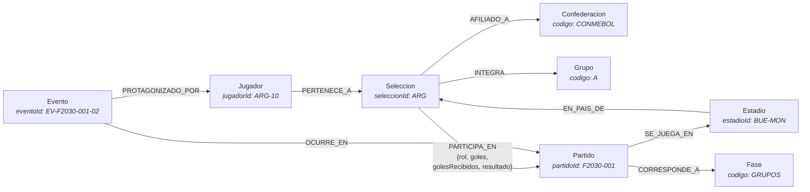

# Modelo del subgrafo — Fixture 2030 (Hito 5)

Documento de referencia del modelo de grafos implementado en Neo4j.
Las justificaciones de cada decisión están en [`decisiones.md`](decisiones.md).

---

## 1. Diagrama del subgrafo

El grafo tiene **8 etiquetas de nodo** y **9 tipos de relación**. Dos ciclos
dan al modelo su capacidad de recorrido:

- `Jugador → Seleccion → Partido ← Evento → Jugador`: conecta a cada futbolista
  con lo que hizo en cada partido.
- `Seleccion → Partido → Estadio → Seleccion`: permite saber si una selección jugó en
  un estadio de su propio país.

---

## 2. Nodos: etiquetas, identificación y propiedades

### 2.1 `:Seleccion` — selección nacional · 64 nodos

| Propiedad | Tipo | Descripción |
|---|---|---|
| `seleccionId` 🔑 | String | **Código FIFA de 3 letras. Es el `_id` de la colección `equipos` del Hito 4.** |
| `pais` | String | Nombre del país (`Argentina`) |
| `nombre` | String | Denominación completa (`Selección de Argentina`) |
| `ranking` | Integer | Posición en el ranking FIFA (1 = mejor) |
| `entrenador` | String | Director técnico |
| `escudo` | String | URL del escudo |
| `anfitrion` | Boolean | Si el país es sede del Mundial |

### 2.2 `:Jugador` — futbolista convocado · 1.536 nodos

| Propiedad | Tipo | Descripción |
|---|---|---|
| `jugadorId` 🔑 | String | **Formato `EQUIPO-DORSAL` (`ARG-10`). Es el `_id` de la colección `jugadores` del Hito 4.** |
| `nombre`, `apellido` | String | Datos personales |
| `nombreCompleto` | String | Derivado, para mostrar y buscar |
| `posicion` | String | `Arquero` \| `Defensor` \| `Mediocampista` \| `Delantero` |
| `fechaNacimiento` | Date | Tipo temporal nativo, no texto |
| `altura`, `peso` | Integer, Float | Centímetros y kilogramos |
| `club` | String | Club de origen |
| `dorsal` | Integer | Número de camiseta (1–24); coincide con el sufijo de `jugadorId` |
| `capitan` | Boolean | Si es el capitán de su selección |

> `dorsal` y `capitan` se modelaron como propiedades del nodo —y no de la
> relación `:PERTENECE_A`— para que la descripción del jugador coincida con la
> del documento del Hito 4 (ver decisión D3).

### 2.3 `:Partido` — encuentro del torneo · 128 nodos

| Propiedad | Tipo | Descripción |
|---|---|---|
| `partidoId` 🔑 | String | `F2030-001` … `F2030-128`, numerados en orden cronológico |
| `fecha` | Date | Tipo nativo: permite filtrar por rango y ordenar |
| `hora` | String | Horario de inicio (`19:00`) |
| `jornada` | Integer | 1–3 en fase de grupos; ausente en eliminatorias |
| `estado` | String | `finalizado` (o `programado` / `en_juego` durante el torneo) |
| `golesLocal`, `golesVisitante` | Integer | Marcador final |
| `definidoPor` | String | `tiempo_reglamentario` \| `penales` |
| `penalesLocal`, `penalesVisitante` | Integer | Sólo en los partidos definidos por penales |

### 2.4 `:Estadio` — estadio · 18 nodos

| Propiedad | Tipo | Descripción |
|---|---|---|
| `estadioId` 🔑 | String | `CIUDAD-ESTADIO` (`MAD-BER`, `MVD-CEN`) |
| `nombre` | String | Nombre del estadio |
| `ciudad` | String | Ciudad |
| `capacidad` | Integer | Espectadores |

> El **país** de la sede no es una propiedad de texto: se expresa con la
> relación `:EN_PAIS_DE` hacia el `:Seleccion` anfitrión (decisión D5).

### 2.5 `:Evento` — hecho deportivo dentro de un partido · 753 nodos

| Propiedad | Tipo | Descripción |
|---|---|---|
| `eventoId` 🔑 | String | `EV-{partidoId}-{nn}` (`EV-F2030-128-01`) |
| `tipo` | String | `gol` \| `penal_convertido` \| `tarjeta_amarilla` \| `tarjeta_roja` |
| `minuto` | Integer | Minuto de juego (hasta 120 con prórroga) |
| `detalle` | String | Descripción legible |

### 2.6 Nodos de clasificación

| Etiqueta | Nodos | Clave | Propiedades |
|---|---|---|---|
| `:Confederacion` | 6 | `codigo` (`UEFA`) | `nombre` |
| `:Grupo` | 16 | `codigo` (`A`…`P`) | — |
| `:Fase` | 7 | `codigo` (`GRUPOS`, `FINAL`) | `nombre`, `orden` (1–7) |

**Total: 2.528 nodos.**

---

## 3. Relaciones: tipo, dirección y cardinalidad

| Relación | Patrón | Cardinalidad | Propiedades | Instancias |
|---|---|---|---|---|
| `PERTENECE_A` | `(:Jugador)→(:Seleccion)` | N:1 — 24 jugadores por selección | — | 1.536 |
| `AFILIADO_A` | `(:Seleccion)→(:Confederacion)` | N:1 | — | 64 |
| `INTEGRA` | `(:Seleccion)→(:Grupo)` | N:1 — 4 equipos por grupo | — | 64 |
| `PARTICIPA_EN` | `(:Seleccion)→(:Partido)` | N:M — **exactamente 2 por partido** | `rol`, `goles`, `golesRecibidos`, `resultado` | 256 |
| `SE_JUEGA_EN` | `(:Partido)→(:Estadio)` | N:1 | — | 128 |
| `CORRESPONDE_A` | `(:Partido)→(:Fase)` | N:1 | — | 128 |
| `EN_PAIS_DE` | `(:Estadio)→(:Seleccion)` | N:1 — sólo los 6 anfitriones | — | 18 |
| `OCURRE_EN` | `(:Evento)→(:Partido)` | N:1 | — | 753 |
| `PROTAGONIZADO_POR` | `(:Evento)→(:Jugador)` | N:1 | — | 753 |

**Total: 3.700 relaciones.**

### Criterio de dirección

Todas las relaciones apuntan **de lo particular hacia lo general**, o **del
hecho hacia la entidad estable**:

- el jugador apunta a su selección (la selección perdura, la convocatoria no);
- el partido apunta a su sede y a su fase (el partido es el hecho puntual);
- el evento apunta al partido y al jugador (el evento es el más efímero).

Cypher recorre relaciones con el mismo costo en ambos sentidos, de modo que la
dirección no limita las consultas: es una convención de modelado que mantiene
el grafo legible. Cuando el sentido no importa —la rivalidad entre dos
selecciones es simétrica— el patrón se escribe sin flecha:
`(a)-[:PARTICIPA_EN]->(p)<-[:PARTICIPA_EN]-(b)`.

---

## 4. Restricciones e índices

### 4.1 Restricciones de unicidad (8)

| Restricción | Etiqueta | Propiedad |
|---|---|---|
| `equipo_id_unico` | `:Seleccion` | `seleccionId` |
| `jugador_id_unico` | `:Jugador` | `jugadorId` |
| `partido_id_unico` | `:Partido` | `partidoId` |
| `sede_id_unico` | `:Estadio` | `estadioId` |
| `evento_id_unico` | `:Evento` | `eventoId` |
| `confederacion_codigo_unico` | `:Confederacion` | `codigo` |
| `grupo_codigo_unico` | `:Grupo` | `codigo` |
| `fase_codigo_unico` | `:Fase` | `codigo` |

Cada restricción crea automáticamente un índice de respaldo y es el soporte de
la idempotencia de la carga: todo `MERGE` se hace sobre una propiedad con
restricción.

### 4.2 Índices declarados (8)

| Índice | Tipo | Destino | Consulta que lo motiva |
|---|---|---|---|
| `partido_fecha` | RANGE | `:Partido(fecha)` | agenda del día (consulta 4.2) |
| `partido_fecha_hora` | RANGE | `:Partido(fecha, hora)` | grilla de programación ordenada |
| `equipo_ranking` | RANGE | `:Seleccion(ranking)` | top-N de selecciones |
| `evento_tipo` | RANGE | `:Evento(tipo)` | goleadores y tarjetas (4.5, 4.11) |
| `jugador_posicion` | RANGE | `:Jugador(posicion)` | planteles por puesto (4.4) |
| `fase_orden` | RANGE | `:Fase(orden)` | recorrido cronológico del torneo |
| `jugadores_por_nombre` | FULLTEXT | `:Jugador(nombre, apellido, club)` | búsqueda tolerante a tipeo (4.12) |
| `equipos_por_nombre` | FULLTEXT | `:Seleccion(pais, nombre)` | búsqueda de selecciones |

Evidencia del efecto de los índices, con planes de ejecución reales:
[`evidencia/09_rendimiento_indices.txt`](evidencia/09_rendimiento_indices.txt).

### 4.3 Limitación de Neo4j Community

Las restricciones de **existencia** (`IS NOT NULL`), de **tipo** y de **clave
de nodo** sólo están disponibles en la edición Enterprise. En este ambiente se
compensan de dos maneras:

1. la carga usa `MERGE` sobre la clave, por lo que ningún nodo puede crearse
   sin identificador;
2. [`queries/verificacion.cypher`](../queries/verificacion.cypher) comprueba
   explícitamente ausencia de nulos, cardinalidades y coherencia interna.

---

## 5. Trazabilidad con el Hito 4

| Entidad | Hito 4 (MongoDB) | Hito 5 (Neo4j) | Ejemplo |
|---|---|---|---|
| Selección | `equipos._id` | `:Seleccion.seleccionId` | `ARG` |
| Jugador | `jugadores._id` | `:Jugador.jugadorId` | `ARG-10` |
| Pertenencia | `jugadores.seleccionId` | relación `:PERTENECE_A` | — |

Los identificadores no se transcriben a mano: `import/generar_dataset.py` lee
los mismos `equipos.json` y `jugadores.json` del módulo documental. La
comprobación automática está en los controles 6.6.1 a 6.6.3 de
`verificacion.cypher`, con resultado **1.536 de 1.536 prefijos coincidentes y
0 divergencias**.
